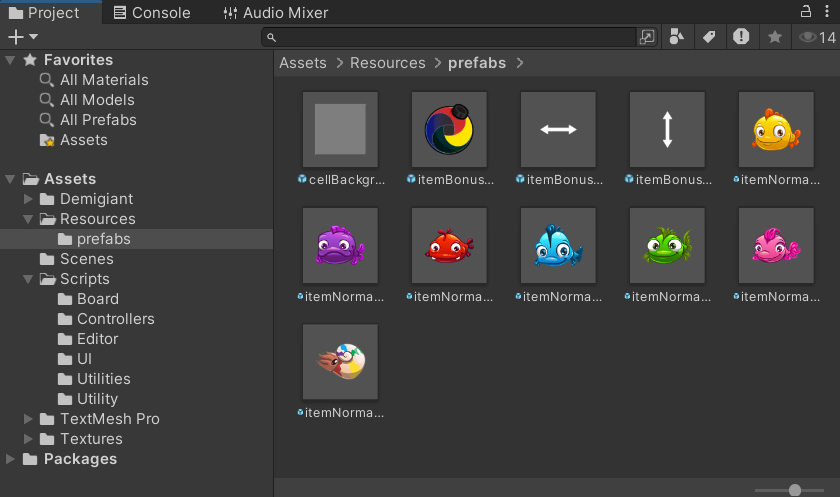

## For Task 1, Reskin from Prefabs:  

 
## Task 2:  
Tldr: Wrote `TrayController.cs` for the new gameplay's logic. `BoardController.cs` was also re-written for handling the new gameplay. Changing from "match-3" game to "title matching" game.  
List of files affected to change gameplay:
- [NEW FILE] TrayController.cs (Core function for the bottom cell where items, when being clicked, will move to)
- BoardController.cs (Rewritten for new core gameplay)
- GameManager.cs (New LoadGame logic. Autoplay logic. GameOver logic.)
- UIMainManager.cs (For Winning and Losing interface)
- Cell.cs (Added property definition for Item)
- Item.cs (Added Virtual Property)
- NormalItem.cs (Added Item ID) 
## Task 3:
List of files affected to add new gameplay mode (Time Attack):
- UIPanelMain.cs (For rigging button to play Time Attack mode and Timer)
- GameManager.cs (New TimeAttack mode logic; including new GameOver style being Timer run out instead of full tray like normal mode)
- TrayController.cs (Added `TryReturnItemAtPosition()` to handle the logic of Returning Item to its old position on board when clicking it on the tray/bottom cell, only during Time Attack mode. Otherwise, disable this function.)
